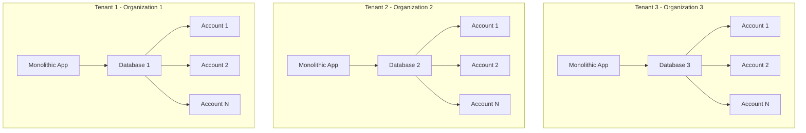
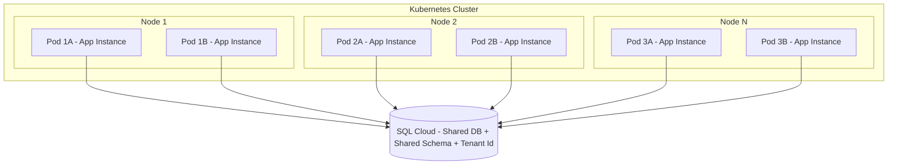
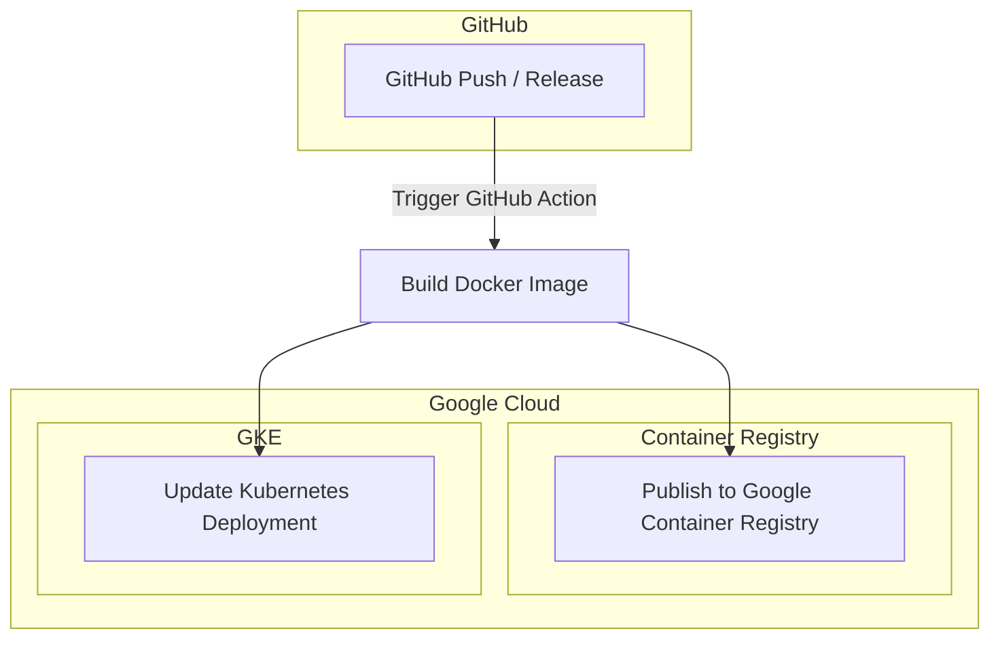

### Request for Comments (RFC)

#### Title

Migrating from AWS to GCP for Cost Efficiency, Improved Application Scalability, and Enhanced Developer Experience

#### Authors
- Felipe Forbeck

#### Abstract
This RFC proposes refactoring a monolithic application to address cost inefficiencies, scalability issues, and improve developer experience by migrating from AWS to GCP. The current setup involves separate server instances and databases for each tenant, leading to high costs and complexity. The goal is to convert the monolith into a multi-tenant application, containerize it with Docker, deploy it on a Kubernetes cluster in GCP, and gradually migrate tenant data from AWS to GCP.

#### Language
The key words "MUST", "MUST NOT", "REQUIRED", "SHALL", "SHALL NOT", "SHOULD", "SHOULD NOT", "RECOMMENDED", "MAY", and "OPTIONAL" in this document are to be interpreted as described in RFC2119.

#### Out of Scope
- Comparison of AWS and GCP services.
- Data migration.
- Post-migration optimizations.

#### Background
The application uses a monolithic architecture on AWS EC2, with each tenant having a separate instance and database. The dedicated team that maintained this infrastructure is no longer available, making it difficult for developers to manage. Developers prefer GCP for its user-friendly interface and their familiarity with it. The current setup is costly due to inefficient resource use, with about 95% of resources being unused. Each tenant represents an organization with multiple associated accounts, a data model we aim to preserve.

#### Problem
- The current monolithic architecture cannot scale horizontally, requiring new application and database instances for each tenant. This leads to inefficiencies and errors when running multiple instances due to Level DB's use of the file system for state data.
- The infrastructure relies on custom libraries from the original maintainers, making it difficult to manage due to the team's limited knowledge and experience with these tools.
- The development team prefers GCP over AWS due to its more user-friendly interface and better alignment with their skills and experience.

#### Challenges
- **Application Refactoring**: The monolithic application MUST be refactored to support a multi-tenant architecture.
- **Containerization**: The application MUST be containerized using Docker to facilitate deployment and management.
- **Database Updates**: The database MUST be updated to support a multi-tenant architecture.
- **Continuous Operation**: AWS services MUST NOT be shut down until the migration to GCP is fully completed and functional to ensure uninterrupted service.
- **Bug Fixes & New Features**: We MUST merge any bug fixes and new features into the new multi-tenant branch on GitHub to keep the codebase compatible and in sync for both versions.
- **CI/CD**: The new application MUST be deployed to the Dev environment on pushes to the `multi-tenant` branch, and to the Prod environment on new GitHub Release tags using semantic versioning, e.g., vX.Y.Z.
- **Tenant Migration**: We MUST gradually migrate the tenant data and ensure the tenant is accessing the correct infrastructure, whether it was migrated or not.
- **GKE Cluster**: We SHALL use Terraform to create our infrastructure as code.

#### Proposal

**Architecture Redesign**

The diagram represents a Kubernetes cluster with 3 nodes, where each node hosts 2 application instances (pods) that all connect to the same shared database. The tenants are identified by their unique IDs.

**Application**
- The new architecture enables horizontal scaling with the addition of new nodes to the cluster.
- We need to refactor the application to receive the tenant ID as part of the URL path, e.g., `https://xyz.com/orgs/:tenant_id`.
- All the function calls in the application have to be refactored to include the tenant ID as part of function arguments, so Reads/Writes operations can include the tenant ID as part of the operation.
- We need to create a wildcard record in our DNS to route all requests from `*.orgs.xyz.com/` to our Redirect Service, which will verify if the tenant is migrated or not. If so, it redirects to the new infra setup `https://xyz.com/orgs/:tenant_id/`, otherwise, it proxies the request to the old infra server.

**Database**
- Update the schema for multi-tenancy, using a shared database with a tenant identifier column for data.
- This setup is easier to maintain and scale, with future potential for sharding based on tenant IDs.
- Gradually migrate single-tenant data to the new multi-tenant setup.
- Host the new database on GCP using SQL Cloud (Postgres).

**CI/CD**
- GitHub actions will be used to build the Docker images and publish them to the Google Container Registry.
- Another action will connect to the Kubernetes cluster and use kubectl to apply the changes made in the k8s descriptors.

**Kubernetes**
- Set up two new Kubernetes clusters on Google Cloud for the deployment of the containerized application: one for the Dev environment and another for the Prod environment.
- The Kubernetes Engine is responsible for managing resource sharing and reclaiming. We don't need to over-provision anymore; we can start with a minimum config setup and monitor the pods to adjust the provisioned resources accordingly.

**Existing Infra Setup**
- The existing infrastructure will be operational until we migrate everything to the new setup and decide the shutdown date.

#### Migration Steps/Major Tasks
- Containerize the application with Docker.
- Refactor to a multi-tenant architecture.
- Set up CI/CD pipelines.
- Configure GCP databases for multi-tenancy.
- Set up GCP environment and GKE clusters.
- Sync `main` & `multi-tenant` branches.
- Configure DNS and update Redirect Service.
- Migrate data from the Development environment first.
- Deploy, test, and validate in Development.
- Migrate data from the Production environment.
- Deploy, test, and validate in Production.

#### Risks
- **Data Integrity**: Ensuring data consistency and integrity during the migration process is crucial.
- **Downtime**: Minimizing downtime during the migration to prevent disruption of services.
- **Compatibility**: Ensuring that the new multi-tenant architecture is compatible with existing application features and functionality.

#### Trade-Off

In order to assess the value of refactoring the application and the database, and migrating from AWS to GCP, we need to take into account the issues we currently face.

**Known Issues**
- **Resource Utilization**: About 95% of resources are unused, causing high costs and inefficiency.
- **Scalability Limitations**: The monolithic architecture cannot scale horizontally, hindering load management and tenant addition, leading to higher costs as customers increase.
- **Maintenance Overhead**: Developers struggle to maintain the custom & complex infrastructure, especially after the original engineers left, and are unfamiliar with AWS tools.

#### Expected Results
- **Cost Reduction**: Achieve a significant reduction in cloud computing costs with the optimization of the application architecture, enabling deployment in a Kubernetes cluster. The GKE resource management capabilities will help us optimize resource utilization, reducing the need for over-provisioning and minimizing waste.
- **Enhanced Scalability**: The new multi-tenant architecture and Kubernetes deployment will allow us to scale horizontally, addressing the current limitations and preparing us for future growth. The cost of adding a new tenant is close to zero because it is just a new row in the database as opposed to a new infra setup for each tenant.
- **Operational Efficiency**: Simplify infrastructure management by moving off customized tooling to a standard setup, thereby reducing maintenance overhead.
- **Developer Satisfaction**: Improve developer satisfaction as they can use familiar tooling and leverage their existing expertise with GCP.
